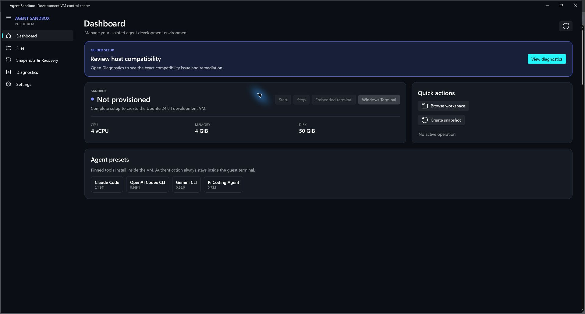

# Agent Sandbox

Agent Sandbox is a GUI-first Windows app for creating and managing isolated Linux development VMs for coding agents. It is designed for people who want repeatable sandboxes without writing PowerShell commands.



> **Development preview:** the application workflows are implemented, but the repository is not release-approved until the physical-hardware, accessibility, and end-to-end matrix in [Implementation status](docs/IMPLEMENTATION-STATUS.md) passes. Preview installers are unsigned and may trigger SmartScreen.

## What it does

- Checks Windows 11 Pro/Enterprise, virtualization, Hyper-V, memory, disk, and Multipass.
- Resumes setup after a reboot and preserves compatible existing Multipass installations.
- Creates and switches between user-named Ubuntu 24.04/22.04, Debian 13, Arch Linux, Fedora Cloud 44, Alpine 3.22, and advanced custom cloud-image VMs, with a read-only import preview for the exact legacy name `agent-dev`.
- Starts and stops the VM, opens a guest terminal, and creates or restores exact-target snapshots.
- Provides a dual-pane host/guest file workspace with staged, verified transfers and recoverable guest trash.
- Supports bidirectional drag/drop, queued cancellation, safe conflict handling, UTF-8 editing, permissions, archives, workspace trash/restore, and opt-in read-only system browsing.
- Includes both an embedded ConPTY terminal and an external Windows Terminal action.
- Offers pinned presets for Codex CLI, Claude Code, Gemini CLI, and Pi. Authentication happens inside the VM.
- Keeps settings and redacted logs local. There is no telemetry or silent updater.

## Requirements

- Windows 11 Pro or Enterprise, x64
- Hardware virtualization and SLAT enabled in firmware
- Administrator approval when enabling Hyper-V or installing Multipass 1.16 or newer
- VM resources depend on the selected image; lightweight profiles can start at 1 GiB RAM and 10 GiB disk
- At least 6 GiB of memory and 10 GiB of disk space must remain available to Windows
- Guest architecture must match the host architecture; the current Windows/Multipass release is x64-only and does not emulate ARM64 guests

Windows Home, macOS, Linux hosts, persistent host mounts, automatic storage migration, and host credential forwarding are outside the v1 boundary.

## Quick start for users

1. Download the `.msi` and matching `.sha256` from a tagged GitHub Release.
2. Verify the checksum and the GitHub artifact attestation.
3. Run the installer. For unsigned previews, SmartScreen may show an unrecognized-app warning.
4. Launch Agent Sandbox and follow the setup wizard. UAC is requested only for a narrow compiled helper operation.
5. Choose resources and optional agent presets, then create the VM.
6. Authenticate an agent from **Open terminal** inside the guest.

Uninstalling Agent Sandbox does **not** delete the VM, its snapshots, or `/home/ubuntu/work`.

## Build from source

Install the .NET 10 SDK and Windows 11 SDK, then:

```powershell
dotnet restore AgentSandbox.slnx --configfile NuGet.Config
dotnet build src/AgentSandbox.App/AgentSandbox.App.csproj -p:Platform=x64
dotnet test tests/AgentSandbox.Domain.Tests/AgentSandbox.Domain.Tests.csproj --no-restore
dotnet test tests/AgentSandbox.Application.Tests/AgentSandbox.Application.Tests.csproj --no-restore
dotnet test tests/AgentSandbox.Infrastructure.Tests/AgentSandbox.Infrastructure.Tests.csproj --no-restore
dotnet test tests/AgentSandbox.Ui.Tests/AgentSandbox.Ui.Tests.csproj --no-restore
python tests/guest_helper_tests.py
```

The production app is C#/.NET 10, WinUI 3, XAML, and MVVM. PowerShell scripts at the repository root and in `scripts/` are retained only as non-authoritative legacy tools; release builds do not elevate or invoke them.

## Repository layout

```text
src/AgentSandbox.App             WinUI shell and view models
src/AgentSandbox.Domain          Typed state, policies, and protocol contracts
src/AgentSandbox.Application     Use cases and service interfaces
src/AgentSandbox.Infrastructure  Multipass, process, settings, files, presets, terminals
src/AgentSandbox.SetupHelper     Narrow, allow-listed elevated helper
guest/guest_helper.py            On-demand standard-library guest file helper
presets/                         Exact-version preset manifests and integrity metadata
tests/                           Unit, contract, and guest-helper tests
installer/                       Unsigned WiX installer project
docs/                            Architecture, threat model, privacy, and operations
```

## Safety model

Agent Sandbox is a development boundary, not a malware-analysis or hostile multi-tenant boundary. Agent-generated code runs in a Hyper-V VM, but any file downloaded to Windows must still be treated as untrusted.

The app uses component-array guest paths, exact Multipass instance names, non-shell process arguments, fail-closed conflicts, symlink/reparse rejection, staged transfers, bounded archive extraction, and exact-target confirmations. The elevated helper accepts only compiled allow-listed operations over a current-user/admin ACL-protected named pipe. See [Threat model](docs/THREAT-MODEL.md) and [Architecture](docs/ARCHITECTURE.md).

## Project policies

- [Security policy](SECURITY.md)
- [Privacy and system changes](docs/PRIVACY.md)
- [Troubleshooting](docs/TROUBLESHOOTING.md)
- [Contributing](CONTRIBUTING.md)
- [Code of conduct](CODE_OF_CONDUCT.md)
- [Release and signing policy](docs/SIGNING.md)
- [Implementation status](docs/IMPLEMENTATION-STATUS.md)
- [Pinned dependencies](docs/PINNED-DEPENDENCIES.md)
- [Changelog](CHANGELOG.md)

## License

MIT. See [LICENSE](LICENSE).
